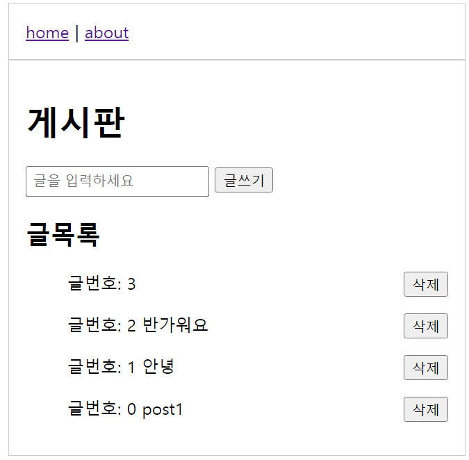

# node-ejs-post-file

 <h2>ejs를 활용한 게시판</h2>
  <ul>  
    <li>node.js / ejs 활용</li>
    <li>index.js에 서버를 구동시키는 코드 추가</li>
    <li>글쓰기 요청(/create) 후 글 목록에 표시 </li>
    <li>글쓰기 삭제 요청(/delete) 기능 추가</li>
    <li>글 목록에 내림차순으로 표시</li>
    

    
  </ul>
